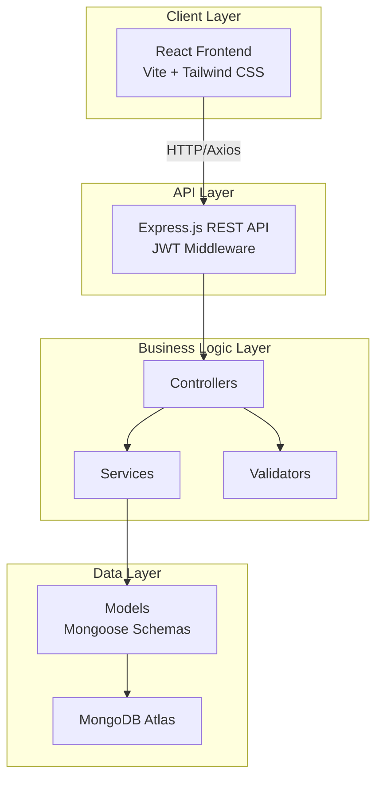
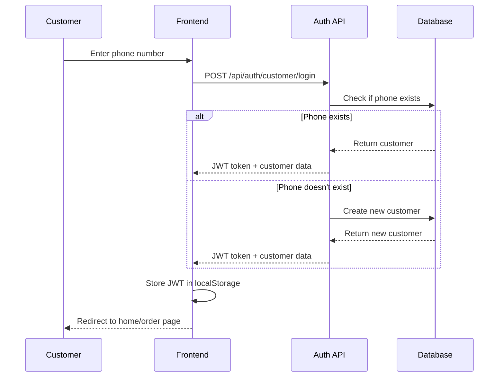
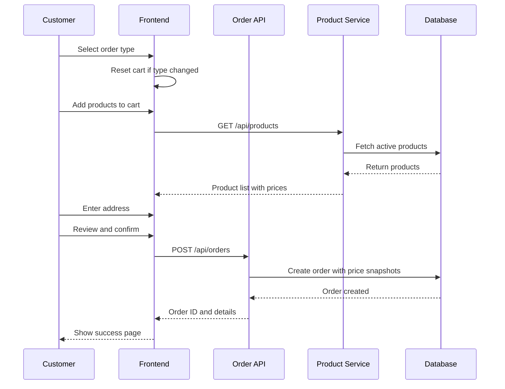
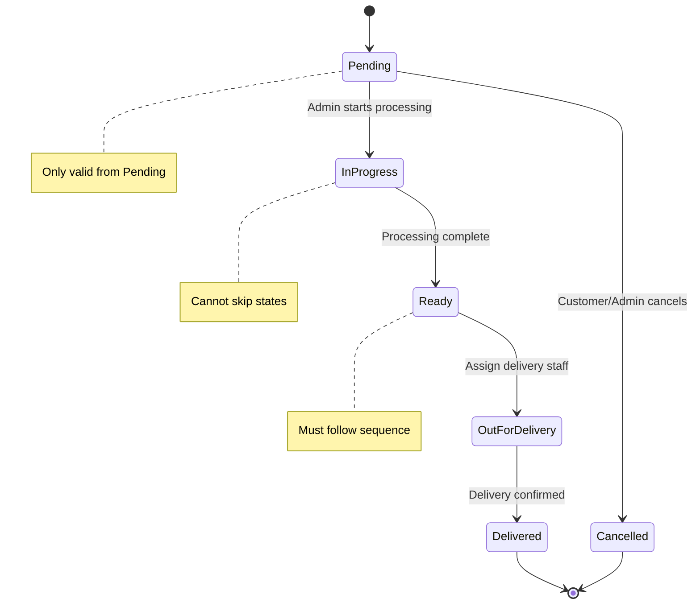

# Design Document

## Overview

The Flour & Spice Grinding Mill Order & Delivery Management System is a full-stack MERN application that enables customers to place orders for grinding services and raw material purchases while providing administrators with comprehensive management tools. The system implements a clean architecture with clear separation between presentation, business logic, and data layers.

The application follows a mobile-first responsive design approach and uses JWT-based authentication with role-based access control. The architecture emphasizes scalability, maintainability, and security through modular design patterns and best practices.

## Architecture

### High-Level Architecture



### Technology Stack

**Frontend:**
- React.js 18+ with Vite for fast development and optimized builds
- Tailwind CSS for utility-first styling and responsive design
- Axios for HTTP requests with interceptors for JWT token management
- React Router v6 for client-side routing and protected routes
- Context API or Zustand for state management
- React Hook Form for form handling and validation
- Recharts or Chart.js for admin dashboard visualizations
- React Toastify for notifications

**Backend:**
- Node.js 18+ with Express.js framework
- Mongoose ODM for MongoDB interactions
- JWT (jsonwebtoken) for authentication
- Bcrypt for password hashing
- Joi or Zod for request validation
- Express-rate-limit for API rate limiting
- CORS for cross-origin resource sharing
- Dotenv for environment variable management

**Database:**
- MongoDB Atlas for cloud-hosted database
- Mongoose for schema definition and validation

**Deployment:**
- Frontend: Vercel
- Backend: Render
- Database: MongoDB Atlas

### Folder Structure

**Backend Structure:**
```
backend/
├── src/
│   ├── config/
│   │   ├── database.js
│   │   └── constants.js
│   ├── models/
│   │   ├── Customer.js
│   │   ├── Product.js
│   │   ├── Order.js
│   │   ├── Admin.js
│   │   └── DeliveryStaff.js
│   ├── controllers/
│   │   ├── authController.js
│   │   ├── customerController.js
│   │   ├── productController.js
│   │   ├── orderController.js
│   │   ├── adminController.js
│   │   └── deliveryStaffController.js
│   ├── services/
│   │   ├── authService.js
│   │   ├── orderService.js
│   │   ├── productService.js
│   │   ├── analyticsService.js
│   │   └── reportService.js
│   ├── middleware/
│   │   ├── authMiddleware.js
│   │   ├── roleMiddleware.js
│   │   ├── errorHandler.js
│   │   └── rateLimiter.js
│   ├── validators/
│   │   ├── authValidator.js
│   │   ├── orderValidator.js
│   │   └── productValidator.js
│   ├── routes/
│   │   ├── authRoutes.js
│   │   ├── customerRoutes.js
│   │   ├── productRoutes.js
│   │   ├── orderRoutes.js
│   │   └── adminRoutes.js
│   ├── utils/
│   │   ├── jwtUtils.js
│   │   ├── responseUtils.js
│   │   └── dateUtils.js
│   └── app.js
├── .env
├── .env.example
├── package.json
└── server.js
```

**Frontend Structure:**
```
frontend/
├── src/
│   ├── api/
│   │   ├── axiosConfig.js
│   │   ├── authApi.js
│   │   ├── productApi.js
│   │   ├── orderApi.js
│   │   └── adminApi.js
│   ├── components/
│   │   ├── common/
│   │   │   ├── Button.jsx
│   │   │   ├── Input.jsx
│   │   │   ├── Loader.jsx
│   │   │   ├── Toast.jsx
│   │   │   └── Modal.jsx
│   │   ├── customer/
│   │   │   ├── ProductCard.jsx
│   │   │   ├── CartItem.jsx
│   │   │   ├── OrderSummary.jsx
│   │   │   └── OrderHistoryCard.jsx
│   │   └── admin/
│   │       ├── OrderTable.jsx
│   │       ├── ProductForm.jsx
│   │       ├── StaffForm.jsx
│   │       └── DashboardChart.jsx
│   ├── pages/
│   │   ├── customer/
│   │   │   ├── HomePage.jsx
│   │   │   ├── LoginPage.jsx
│   │   │   ├── OrderTypePage.jsx
│   │   │   ├── ProductSelectionPage.jsx
│   │   │   ├── AddressPage.jsx
│   │   │   ├── ReviewPage.jsx
│   │   │   ├── SuccessPage.jsx
│   │   │   └── OrderHistoryPage.jsx
│   │   └── admin/
│   │       ├── AdminLoginPage.jsx
│   │       ├── DashboardPage.jsx
│   │       ├── OrderManagementPage.jsx
│   │       ├── ProductManagementPage.jsx
│   │       ├── StaffManagementPage.jsx
│   │       └── ReportsPage.jsx
│   ├── context/
│   │   ├── AuthContext.jsx
│   │   └── CartContext.jsx
│   ├── hooks/
│   │   ├── useAuth.js
│   │   ├── useCart.js
│   │   └── useToast.js
│   ├── utils/
│   │   ├── formatters.js
│   │   ├── validators.js
│   │   └── constants.js
│   ├── routes/
│   │   ├── ProtectedRoute.jsx
│   │   └── AdminRoute.jsx
│   ├── App.jsx
│   └── main.jsx
├── .env
├── .env.example
├── package.json
├── tailwind.config.js
└── vite.config.js
```

## Components and Interfaces

### Authentication Flow



### Order Creation Flow



### Admin Order Status Update Flow



## Data Models

### Customer Schema

```javascript
{
  name: String (required),
  phone: String (required, unique, indexed),
  streetType: String (enum: ['Center', 'Top', 'Down side']),
  houseName: String,
  doorNo: String,
  landmark: String (optional),
  role: String (default: 'customer'),
  createdAt: Date (default: Date.now),
  updatedAt: Date
}
```

### Product Schema

```javascript
{
  name: String (required, unique),
  rawMaterialPricePerKg: Number (required, min: 0),
  grindingChargePerKg: Number (required, min: 0),
  isActive: Boolean (default: true),
  description: String (optional),
  createdAt: Date (default: Date.now),
  updatedAt: Date
}
```

### Order Schema

```javascript
{
  customerId: ObjectId (ref: 'Customer', required, indexed),
  orderType: String (enum: ['serviceOnly', 'buyAndService'], required),
  items: [{
    productId: ObjectId (ref: 'Product', required),
    productName: String (required),
    quantity: Number (required, min: 0.1),
    grindType: String (enum: ['Fine', 'Medium', 'Coarse'], required),
    rawMaterialPriceSnapshot: Number (required),
    grindingChargeSnapshot: Number (required),
    itemTotal: Number (required)
  }],
  deliveryAddress: {
    name: String (required),
    phone: String (required),
    streetType: String (required),
    houseName: String (required),
    doorNo: String (required),
    landmark: String (optional)
  },
  deliveryType: String (enum: ['Pickup', 'Delivery'], default: 'Delivery'),
  deliveryStaffId: ObjectId (ref: 'DeliveryStaff', optional),
  totalAmount: Number (required),
  status: String (enum: ['Pending', 'InProgress', 'Ready', 'OutForDelivery', 'Delivered', 'Cancelled'], default: 'Pending', indexed),
  estimatedReadyDate: Date,
  createdAt: Date (default: Date.now, indexed),
  updatedAt: Date
}
```

### Admin Schema

```javascript
{
  username: String (required, unique),
  password: String (required, hashed with bcrypt),
  role: String (default: 'admin'),
  createdAt: Date (default: Date.now),
  updatedAt: Date
}
```

### DeliveryStaff Schema

```javascript
{
  name: String (required),
  phone: String (required, unique),
  isActive: Boolean (default: true),
  createdAt: Date (default: Date.now),
  updatedAt: Date
}
```

## API Endpoints

### Authentication Routes

```
POST   /api/auth/customer/login          - Customer login/register by phone
POST   /api/auth/admin/login             - Admin login with credentials
POST   /api/auth/verify                  - Verify JWT token validity
```

### Customer Routes (Protected)

```
GET    /api/customer/profile             - Get customer profile
PUT    /api/customer/profile             - Update customer address
GET    /api/customer/orders              - Get customer order history
GET    /api/customer/orders/:id          - Get specific order details
PUT    /api/customer/orders/:id/cancel   - Cancel pending order
```

### Product Routes

```
GET    /api/products                     - Get all active products (public)
GET    /api/products/:id                 - Get product by ID (public)
POST   /api/products                     - Create product (admin only)
PUT    /api/products/:id                 - Update product (admin only)
PATCH  /api/products/:id/toggle          - Enable/disable product (admin only)
```

### Order Routes

```
POST   /api/orders                       - Create new order (customer)
GET    /api/orders                       - Get all orders (admin)
GET    /api/orders/:id                   - Get order by ID
PUT    /api/orders/:id/status            - Update order status (admin)
PUT    /api/orders/:id/assign-staff      - Assign delivery staff (admin)
```

### Admin Routes (Admin Only)

```
GET    /api/admin/dashboard              - Get dashboard metrics
GET    /api/admin/analytics/orders       - Get order analytics
GET    /api/admin/analytics/revenue      - Get revenue analytics
GET    /api/admin/reports/export         - Export CSV report
```

### Delivery Staff Routes (Admin Only)

```
GET    /api/delivery-staff               - Get all delivery staff
POST   /api/delivery-staff               - Add delivery staff
PUT    /api/delivery-staff/:id           - Update delivery staff
PATCH  /api/delivery-staff/:id/toggle    - Activate/deactivate staff
GET    /api/delivery-staff/:id/deliveries - Get staff delivery count
```

## Business Logic

### Pricing Calculation

**Service Only Order:**
```javascript
itemTotal = quantity * grindingChargePerKg
orderTotal = sum of all itemTotals
```

**Buy + Grinding Order:**
```javascript
itemTotal = quantity * (rawMaterialPricePerKg + grindingChargePerKg)
orderTotal = sum of all itemTotals
```

**Price Snapshot Mechanism:**
- When order is created, capture current product prices
- Store snapshots in order items
- Use snapshots for all order calculations and displays
- Product price changes don't affect existing orders

### Order Status Workflow Validation

```javascript
const validTransitions = {
  'Pending': ['InProgress', 'Cancelled'],
  'InProgress': ['Ready', 'Cancelled'],
  'Ready': ['OutForDelivery', 'Cancelled'],
  'OutForDelivery': ['Delivered', 'Cancelled'],
  'Delivered': [],
  'Cancelled': []
};

function isValidTransition(currentStatus, newStatus) {
  return validTransitions[currentStatus].includes(newStatus);
}
```

### Estimated Ready Date Calculation

```javascript
// Add 2 business days from order creation
function calculateEstimatedReadyDate(orderDate) {
  const readyDate = new Date(orderDate);
  let daysAdded = 0;
  
  while (daysAdded < 2) {
    readyDate.setDate(readyDate.getDate() + 1);
    // Skip Sundays (0) if mill is closed
    if (readyDate.getDay() !== 0) {
      daysAdded++;
    }
  }
  
  return readyDate;
}
```

### Cart Management

**Cart State Structure:**
```javascript
{
  orderType: 'serviceOnly' | 'buyAndService',
  items: [
    {
      productId: string,
      productName: string,
      quantity: number,
      grindType: 'Fine' | 'Medium' | 'Coarse',
      rawMaterialPrice: number,
      grindingCharge: number,
      itemTotal: number
    }
  ],
  totalAmount: number
}
```

**Cart Reset Logic:**
- When order type changes, clear all items
- When customer logs out, clear cart
- After successful order, clear cart

## Error Handling

### Error Response Format

```javascript
{
  success: false,
  error: {
    code: 'ERROR_CODE',
    message: 'User-friendly error message',
    details: {} // Optional additional details
  }
}
```

### Error Categories

**Authentication Errors (401):**
- INVALID_TOKEN: JWT token is invalid or expired
- UNAUTHORIZED: User not authenticated
- INVALID_CREDENTIALS: Login credentials incorrect

**Authorization Errors (403):**
- FORBIDDEN: User lacks required permissions
- INVALID_ROLE: User role not authorized for action

**Validation Errors (400):**
- VALIDATION_ERROR: Input validation failed
- INVALID_ORDER_TYPE: Order type not recognized
- INVALID_STATUS_TRANSITION: Order status change not allowed
- MISSING_REQUIRED_FIELD: Required field not provided

**Resource Errors (404):**
- NOT_FOUND: Requested resource doesn't exist
- PRODUCT_NOT_FOUND: Product ID invalid
- ORDER_NOT_FOUND: Order ID invalid

**Business Logic Errors (422):**
- PRODUCT_INACTIVE: Selected product is disabled
- CANNOT_CANCEL_ORDER: Order status doesn't allow cancellation
- EMPTY_CART: Cannot create order with no items

**Server Errors (500):**
- INTERNAL_ERROR: Unexpected server error
- DATABASE_ERROR: Database operation failed

### Frontend Error Handling

```javascript
// Axios interceptor for global error handling
axios.interceptors.response.use(
  response => response,
  error => {
    if (error.response?.status === 401) {
      // Clear auth and redirect to login
      localStorage.removeItem('token');
      window.location.href = '/login';
    }
    
    // Show toast notification
    toast.error(error.response?.data?.error?.message || 'An error occurred');
    
    return Promise.reject(error);
  }
);
```

## Security Considerations

### JWT Implementation

**Token Structure:**
```javascript
{
  userId: string,
  role: 'customer' | 'admin',
  iat: number,
  exp: number // 7 days for customer, 24 hours for admin
}
```

**Token Storage:**
- Frontend: localStorage for persistence
- Backend: No server-side storage (stateless)

**Token Validation:**
- Verify signature on every protected route
- Check expiration
- Validate role for admin routes

### Password Security

- Use bcrypt with salt rounds of 10
- Never log or expose passwords
- Implement password complexity requirements for admin

### Rate Limiting

```javascript
// Login endpoints: 5 requests per 15 minutes per IP
// General API: 100 requests per 15 minutes per IP
// Admin endpoints: 50 requests per 15 minutes per IP
```

### Input Validation

- Validate all inputs on backend using Joi/Zod
- Sanitize inputs to prevent injection attacks
- Validate phone number format (10 digits)
- Validate quantity (positive numbers)
- Validate ObjectId format for MongoDB references

### CORS Configuration

```javascript
const corsOptions = {
  origin: process.env.FRONTEND_URL,
  credentials: true,
  optionsSuccessStatus: 200
};
```

## Testing Strategy

### Backend Testing

**Unit Tests:**
- Service layer functions (pricing calculations, date calculations)
- Validation schemas
- Utility functions (JWT generation, formatting)

**Integration Tests:**
- API endpoints with database interactions
- Authentication middleware
- Order status workflow validation

**Test Coverage Goals:**
- Services: 80%+
- Controllers: 70%+
- Middleware: 80%+

### Frontend Testing

**Component Tests:**
- Form validation and submission
- Cart operations (add, remove, update)
- Protected route behavior

**Integration Tests:**
- Complete order flow
- Login and authentication
- Admin dashboard interactions

**E2E Tests (Optional):**
- Customer order placement flow
- Admin order management flow

### Testing Tools

- Backend: Jest + Supertest
- Frontend: Vitest + React Testing Library
- E2E: Playwright or Cypress (optional)

## Performance Considerations

### Database Optimization

**Indexes:**
```javascript
// Customer
phone: unique index

// Order
customerId: index
status: index
createdAt: index (for date range queries)

// Product
name: unique index
isActive: index
```

**Query Optimization:**
- Use projection to limit returned fields
- Implement pagination for order lists (20 items per page)
- Use aggregation pipeline for analytics queries

### Frontend Optimization

- Lazy load admin pages
- Implement virtual scrolling for long order lists
- Debounce search and filter inputs
- Cache product list in context
- Optimize images (WebP format, lazy loading)

### API Optimization

- Implement response compression (gzip)
- Use HTTP caching headers for static data
- Batch related queries where possible
- Implement request debouncing on frontend

## Mobile-First Design Principles

### Responsive Breakpoints

```javascript
// Tailwind CSS breakpoints
sm: '640px'   // Small tablets
md: '768px'   // Tablets
lg: '1024px'  // Laptops
xl: '1280px'  // Desktops
```

### Mobile UI Patterns

**Touch Targets:**
- Minimum 44x44px for buttons
- Adequate spacing between interactive elements

**Input Fields:**
- Large text size (16px minimum to prevent zoom)
- Clear labels and placeholders
- Numeric keyboard for quantity and phone inputs

**Navigation:**
- Bottom navigation bar for main customer actions
- Hamburger menu for secondary navigation
- Sticky cart button with item count badge

**Forms:**
- One column layout on mobile
- Progressive disclosure (multi-step forms)
- Clear progress indicators

### Performance on Mobile

- Minimize bundle size (code splitting)
- Optimize images for mobile bandwidth
- Implement service worker for offline capability (future enhancement)
- Use CSS animations over JavaScript

## Deployment Configuration

### Environment Variables

**Backend (.env):**
```
NODE_ENV=production
PORT=5000
MONGODB_URI=mongodb+srv://...
JWT_SECRET=...
JWT_EXPIRE=7d
ADMIN_JWT_EXPIRE=24h
FRONTEND_URL=https://...
```

**Frontend (.env):**
```
VITE_API_URL=https://api...
VITE_GOOGLE_MAPS_API_KEY=...
```

### Deployment Steps

**Backend (Render):**
1. Connect GitHub repository
2. Set environment variables
3. Configure build command: `npm install`
4. Configure start command: `npm start`
5. Enable auto-deploy on push

**Frontend (Vercel):**
1. Connect GitHub repository
2. Set environment variables
3. Configure build command: `npm run build`
4. Configure output directory: `dist`
5. Enable auto-deploy on push

**Database (MongoDB Atlas):**
1. Create cluster
2. Configure network access (allow Render IPs)
3. Create database user
4. Get connection string
5. Configure backup schedule

### Production Checklist

- [ ] Environment variables configured
- [ ] CORS configured for production URLs
- [ ] Rate limiting enabled
- [ ] Error logging configured (e.g., Sentry)
- [ ] Database indexes created
- [ ] SSL/HTTPS enabled
- [ ] Admin user created
- [ ] Sample products added
- [ ] API documentation updated
- [ ] Monitoring configured

## Future Enhancements

- SMS notifications for order status updates
- Payment gateway integration
- Customer reviews and ratings
- Loyalty points system
- Multi-language support
- Push notifications (PWA)
- Real-time order tracking
- Inventory management
- Automated backup system
- Advanced analytics and reporting
